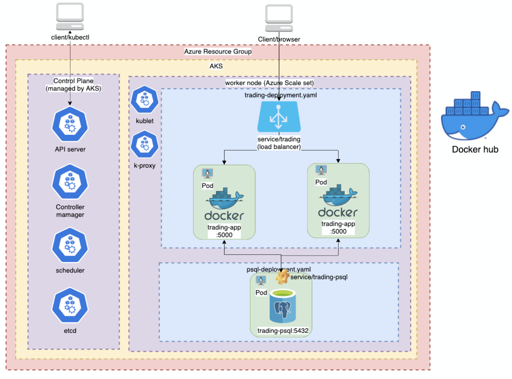
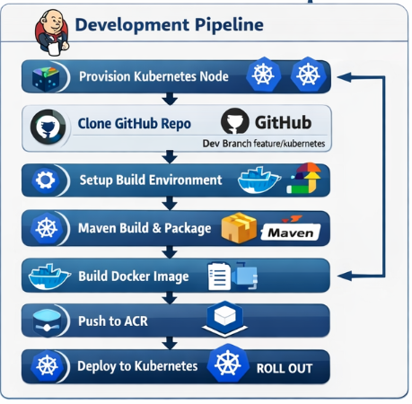

# Introduction
- The application architecture was implemented in two different places. The first place is locally by using a minikube setup in order to do local testing while developing. The second is by using Azure Kubernetes Service and provisioning two different nodes, one for Dev and one for Production. The application is packaged and stored as a container by using ACR and pulled by AKS in order to function. AKS itself comes with built in load balancing and does not need to be load managed manually. The psql connected to the application is similarly provisioned by utilizing a containerized psql setup.
- In terms of development and production, two different nodes are provisioned in the AKS, one for dev and one for prod. They both have its own deployment pipelines using Jenkins which utilizes different branches in github, dev pulls from feature/kubernetes while prod pulls from main.
- The Jenkins pipeline for deployment follows the following steps
  - First it provisions a node from kubernetes to run following processes.
  - It then clones the github repository of the branch defined by the target (either dev or prod)
  - Then, following the instructions of the JenkinsFile, it pulls two image from docker so that they can make a container that can do docker actions, run maven, and run kube commands.
  - It then packages the trading project by utilizing its maven container.
  - Then it follows the instruction of the DockerFile to dockerize the packaged application then push it to the registry.
  - Finally, it tells kube to do a rollout of the trading application such that the changes are applied.

# Application Architecture
]
# Jenkins CI/CD pipeline
- The Jenkins pipeline for deployment follows the following steps
    - First it provisions a node from kubernetes to run following processes.
    - It then clones the github repository of the branch defined by the target (either dev or prod)
      - git clone
    - Then, following the instructions of the JenkinsFile, it pulls two image from docker so that they can make a container that can do docker actions, run maven, and run kube commands.
      - Custom container for both Maven and Kube functions
      - Dind for running docker function
    - It then packages the trading project by utilizing its maven container.
      -    sh 'cd springboot && mvn clean package'

    - Then it follows the instruction of the DockerFile to dockerize the packaged application then push it to the registry.
      - sh "cd springboot && docker build -t \$IMAGE_NAME:$IMAGE_TAG ."
      - docker push \$IMAGE_NAME:$IMAGE_TAG
    - Finally, it tells kube to do a rollout of the trading application such that the changes are applied.
      - kubectl rollout status deployment/trading -n default

# Improvements
- Include server testing and deployment testing in the Jenkins file instead of just Integration/Unit Test in Maven
- Add a QA environment for QA testing
- Include updates to the PSQL server in the deployment pipeline so that it is also automated
